# Chapter 1 Introduction

*注：图片来源于网络和Ian的课本中，如有侵权请联系我删除。文中的“我”一般指的是读者，“我们”一般指教科书的作者或泛称。第一章内容中读者增加了不少内容，在原书的基础上进行了相应的补充。读者直接阅读英文原版做整理，可能会出现译名上的错误，如有错误麻烦告诉读者，不胜感激。*

## 全书导航

本书主要目标读者是准备学习或刚开始从事深度学习和人工智能研究的学生，或者希望迅速获得相关知识的软件工程师。

本书主要分为三个部分：

* 第一部分（Ch.2 - Ch.5）介绍基本的数学工具和机器学习概念
* 第二部分（Ch.6 - Ch.12）描述最成熟的深度学习算法，这些算法基本上是已经解决的问题和技术
* 第三部分（Ch.13 - Ch.20）则描述了一些更具探索性的想法，这些想法被广泛认为对未来深度学习研究至关重要

每一章节之间的关系等如下图所示：

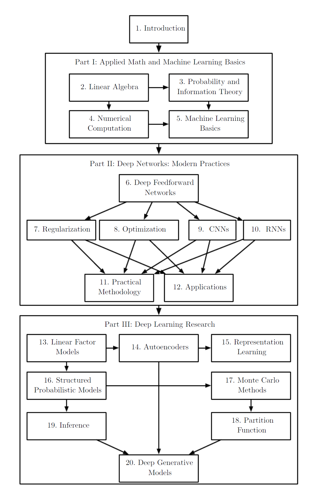{style="display:block; margin:auto; width:800px;"}

在学习的时候，作者提示学习者可以自由跳过与自己的兴趣或背景无关的部分。例如，熟悉线性代数、概率论和基本机器学习概念的话可以跳过第一部分；如果主要是用深度学习来实现可工作的系统则无需阅读第三部分。

此外，本书中的内容建立在假设所有读者都来自于计算机科学背景之上，包括熟悉变成、具备对计算性能问题、复杂性理论、初级微积分以及图论术语的一些基本理解。

## 导读：什么是深度学习

发明家们一直梦想着创造会思考的机器。古希腊神话中有很多关于发明家和人造生命（artificial life）的故事，发明家比如皮格马利翁、代达罗斯、赫菲斯托斯，人造生命则比如加拉蒂亚、代达罗斯与塔洛斯、赫菲斯托斯与潘多拉等。

{style="display:block; margin:auto; width:400px;"}

上图是名画《皮格马利翁与加拉蒂亚》。皮格马利翁是希腊神话中的塞浦路斯国王，据古罗马诗人奥维德《变形记》中记述，皮格马利翁是一名雕刻家，他根据自己心中理想的女性形象创作了一个象牙雕塑。他爱上了他的作品，并起名为加拉蒂亚。爱神阿弗洛狄忒同情他，便让雕塑获得了生命。

{style="display:block; margin:auto; width:400px;"}

代达罗斯是伊卡洛斯的父亲，也是伊卡洛斯那对翅膀的发明人。他是一个著名的建筑师和工匠，除了伊卡洛斯的翅膀外，他还制造了囚禁米诺陶诺斯的迷宫。走迷宫、搜索、下棋、路径规划等“搜索”任务在人工智能的早期发展中是一个非常重要的部分。

Sutton曾说：“我们必须接受一个苦涩的教训，那就是试图通过人为构建我们的思维方式来解决复杂问题，在长期来看并不可行。”因此AI可以认为由两大内容组成：一是学习（利用数据来提取模式），二是搜索和优化（使用计算来提取推断）。

{style="display:block; margin:auto; width:400px;"}

具有智慧的青铜巨人塔洛斯，在传说中所向无敌。在伊阿宋带领阿尔戈英雄们夺取金羊毛的的冒险中，拥有强力魔法的美狄亚设计击败了塔洛斯。

在中国古代的《列子》中，有一个偃师造人的故事。周穆王巡游的时候碰到了一个叫做偃师的人，制造了一个和真人一模一样的人造人。结果假人因为向周穆王的侍妾们挤眉弄眼，惹得周穆王大怒。偃师怕周穆王把自己杀掉，就把这个假人拆开来，结果里头都是些皮革、木头等人造物组成的。

当可编程计算机首次被构想出来的时候，人们就在思考这台机器是否能够变得智能，这种想法在1842年Lovelace的时代就已经存在了，比第一台现代意义上的计算机还早了100年。

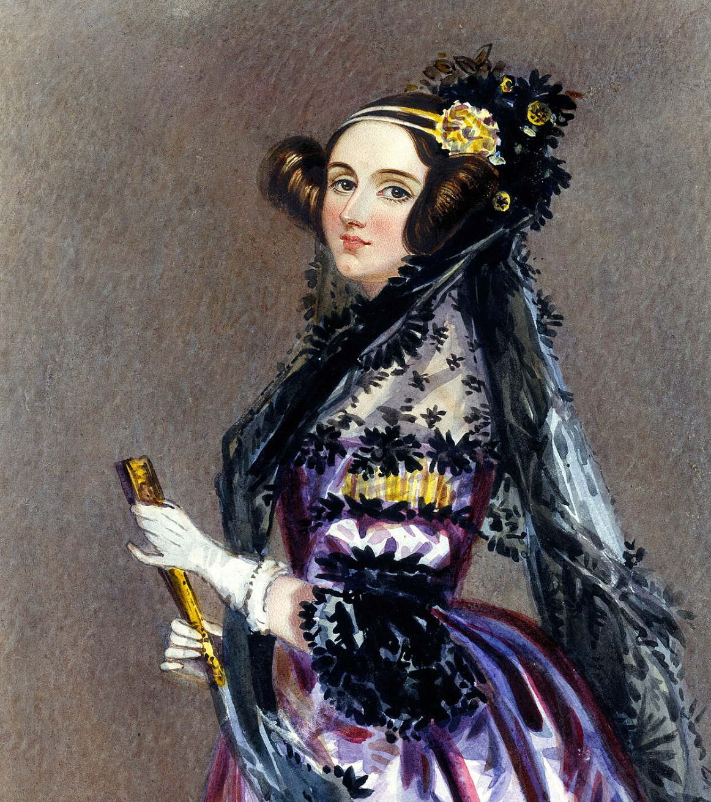{style="display:block; margin:auto; width:400px;"}

Ada Lovelace是第一位主张计算机不只可以用来算数的人，也发表了第一段分析机用的算法，一般也被认为是史上第一位程序员。尽管对于Ada是否是真正的第一个程序员有不少争议，但大多数人都不否认她是第一个明确看出分析机未来可以处理数字以外的大千世界的人。对于被认为更早就写出程序的后世被尊称为电脑之父的巴贝奇而言，分析机就是一个用来算数的机器，但Ada却看到如果有一台可以操作数字的机器，那么只要数字可以表示其他事物，像是字母、音符等，这台机器就可以按照规则，以数字来操作符号。这种构思其实就是一种非常早期的对于机器能否变得更加智能的思考，因此在讨论人工智能的时候，我还是很想把Ada拿出来放在其中。

如今，人工智能（AI）已经是一个充满活力的领域，具有许多实际应用并活跃于研究前沿。我们使用智能软件来自动完成重复性劳动、理解语音或图像、进行医疗诊断以及支持基础科研。

在人工智能的早期，研究领域迅速解决了一些对人类来说在智力上具有挑战性，但对计算机而言相对简单的问题：这些问题可以用一系列数学公式化规则来描述。而人工智能的真正挑战在于解决那些对人来说很容易完成，但却难以正式描述的问题，比如识别语音中的词语或图像中的人脸。对人而言，这些问题是非常直觉化的，甚至不需要“动脑子”就能找到答案，但对计算机来说，却是一个长期都无法被很好解决的难题。

本书关注的就是这些直觉化的问题。本书探讨的解决方案是让计算机通过经验学习并理解世界，它通过一个概念层级来实现，每个概念通过与简单概念之间的关系来定义。我们无需人为地定义知识点，计算机可以通过经验获取知识。这种概念层级允许计算机通过组合简单概念来学习复杂概念，如果我们用图形来表示这些概念之间的构建关系，这个图将有很多层，换句话说就是“非常深”，因此我们称这种方法为**深度学习（deep learning）**。

在过去，计算机常被用来解决那些规则相对简单的理想化环境中的问题，比如国际象棋。对人来说，这在智力上非常具有挑战性，但是计算机却能很简单地处理。但是那些人类看起来非常简单的事情：找到自己的母亲、做饭、叠被子、从一个人的动作神态中感受他的情绪等，却是计算机很难甚至可以说无法做到的。在三十年前，计算机就能击败世界上最优秀的国际象棋选手，但到读者写这份笔记的2026年，在LLM已经可以很好地和人沟通、交流地今天，做饭、叠被子依然是机器人几乎无法完成的任务。现实世界不具备理想化的环境，从而让计算机难以进行形式化语言表达。甚至可以说，计算机发展到今天，即便已经如此令人惊叹，但其本质还是200年前Ada所畅想地那样：通过数字来进行操作。即便是如今令人震惊的ChatGPT，依然也没有脱离这个范畴。

人工智能的发展焦点在于智能，这是基于人类自身所总结出来的一种特质。可以说，人们所说的智能，就是人类自己所具备的这种思维方式和思考能力。人类天生具备的对现实世界要素进行处理的能力计算机并不具备，因此如果想让这些乱七八糟的现实世界的要素让计算机学会，计算机才有可能表现出智能行为。

在人工智能发展的早期，知识库（knowledge base）被用来把现实世界的知识以形式化语言的方式硬编码进系统中。计算机依然可以用逻辑推理规则对这些形式语言进行推理。然而，没有任何一个该类项目取得重大成功。其中最著名的莫过于1989年的Cyc项目，这是一个推理引擎和使用CycL语言表达的知识数据库。人类监督员手动录入所有的信息，这是一个相当笨重的过程。人们很难用足够的复杂的形式规则来准确描述现实世界，例如，Cyc无法理解“有个叫做Fred的人早晨在刮胡子”，因为其推理引擎中发现故事中存在矛盾：人类没有电子部件，但是Fred拿着电动剃须刀，所以它认定“FredWhileShaving”是一个含有电子部件的实体，因此它提出疑问“Fred在刮胡子时还是不是一个人？”。

基于硬编码知识的系统所面临的困难表明，AI系统需要具备自主学习知识的能力，也就是通过从原始数据中提取模式来获得知识。这种能力被称为**机器学习（machine learning）**。

机器学习的引入使得计算机能够处理涉及现实世界知识的问题，并作出看似主观的决策。在读者的强化学习笔记的第一章中，作者们提到在上世纪70、80年代，大量的研究试错学习的人后来都转向了机器学习（特别是监督学习）。

简单而常见的机器学习算法包括**逻辑回归（logistic regression）**和**朴素贝叶斯（naive Bayes）**等。他们可以用于识别垃圾邮件、建议是否应该剖腹产等。这类**监督学习（supervised learning）**算法的性能很大程度上取决于输入数据的**表示方式（representation）**。例如，逻辑回归用于建议剖腹产时，并不会直接分析病人，而是由医生告知系统一些关键信息，比如是否存在子宫疤痕，这时每个信息点都被称为一个**特征（feature）**。逻辑回归学习这些特征与结果之间的关系，但它并不能影响这些特征是如何定义的。如果给逻辑回归模型一份病人的MRI图像，而不是医生的格式化报告，它将无法做出有效预测，因为MRI图像中的单个像素和剖腹产的并发症几乎没有关系。

这种对表示方式的依赖是计算机科学和日常生活中的普遍现象。在计算机科学中，比如数据检索操作，如果数据结构良好并被智能地索引，可以大大提高搜索效率。人类在处理阿拉伯数字时可以轻松计算，但是在使用罗马数字时则会变得异常困难。因此，表示方式对机器学习算法性能的影响是显著的。

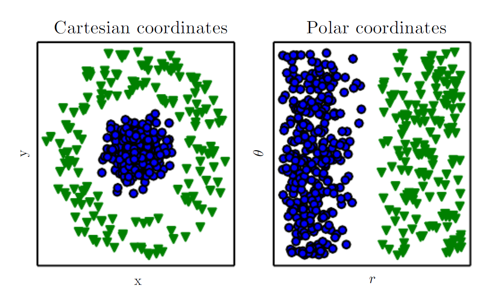{style="display:block; margin:auto; width:500px;"}

书中给出了上图作为示例：假设我们想在散点图中通过画一条直线将两类数据分开，按照左图的笛卡尔坐标系，我们将无法完成该任务。但是如果把同样的数据转换为右图所示的极坐标系，那么画这条直线将变得非常轻松。可见机器学习算法的性能严重依赖于表示方式。

许多人工智能任务都可以通过设计合适的特征提取方法来解决，然后将这些特征输入一个简单的机器学习算法中。比如在语音识别中，一个有用的特征是说话人声道的大小估计值，它可以提供线索判断说话人是男性、女性还是儿童。然而，对于许多任务来说，我们很难甚至根本无从得知应该提取哪些特征。例如，我们想识别图片中汽车的程序，我们可能会去想把轮子作为一个特征，但轮子长得又千奇百怪，而且图片中可能会有阴影、反光、部分阻挡等。

为了解决特征提取的问题，我们可以使用机器学习来不仅发现从表示到输出的映射，而且还能自动发现表示本身。这种方法称为**表征学习（representation learning）**。这种方法通常比人工设计的表示能带来更好的性能，并且可以让AI系统在很少人工干预的情况下，快速适应新任务。

一个表征学习算法可以在几分钟内为一个简单任务发现良好的特征合集，或者在数小时到数月内解决复杂任务——这些复杂任务靠人工设计特征可能要耗费大量人力和时间。

一个典型的表征学习算法是**自编码器（autoencoder）**。自编码器由两部分组成：

* **编码器（encoder）：将输入数据转换成另一种表示**
* **解码器（decoder）：将这种新的表示再转换回原始格式**

自编码器的训练目标是尽可能保留输入信息，也就是编码后再解码，仍能还原出原始数据。同时，它也试图让新的表示具备某些良好的属性。不同类型的自编码器会追求不同的特性。我们在这些任务中的目标通常是分离出解释观测数据的“变化因素”（factors of variation）。这些因素是影响观测结果的独立变量。在本上下文中，“因素”一词仅表示独立的影响来源，这些来源通常不是通过数学乘法组合的。

这些因素不一定是我们直接观测到的数量，他们还可能是物理世界中不可见但影响可观察量的对象或力；抑或是人类大脑中构造出来的简化模型或抽象概念。比如说，在分析语音时，变化因素可能包括说话人的年龄、性别、口音和所说的词汇；汽车图片则包括位置、颜色、角度、光影等。

现实世界的人工智能任务之所以困难，很大一部分原因就在于此：这些变化因素会同时影响我们所能观测到的每一个数据点。比如，红色汽车在夜间图像中的像素可能接近黑色，汽车轮廓在不同角度中非常不同等。我们通常需要将这些变化因素解缠（disentangle），仅保留我们关心的部分而丢弃其他无关因素。

但是，在实际任务中，从原始数据中提取出这样的高级、抽象特征是非常困难的。当学习一个表示本身几乎和要解决的问题一样复杂时，表征学习看似并无帮助。这个时候，深度学习就能解决这个核心难题。

深度学习通过构建层级式的表示，把复杂概念用多个更加简单的表示层级来表达。深度学习让计算机能够将复杂概念逐步构建而成。

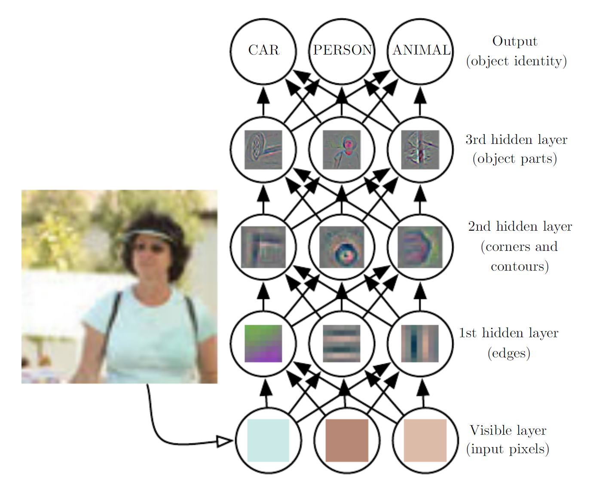{style="display:block; margin:auto; width:500px;"}

例如上图所示。上图展示了一个深度学习系统如何表示一个人的图像：它将人脸表示为简单形状组成的结构，比如边角和轮廓，而这些更小的元素又是由边缘等更基本的结构构成。计算机很难理解原始感官输入数据的含义，比如图中所示的图像对计算机来说就是一堆像素点，而从一个像素集合映射到对象身份的函数是非常复杂的。如果直接去学习或者评估这种映射，看起来几乎无法完成。深度学习通过将这个复杂的映射拆分成一系列嵌套的简单映射来解决这个困难。每一个映射由模型的一层表示：

* 输入首先被呈现在**可见层（visible layer）**，这个名字是因为它包含的是我们可以观察到的变量。
* 然后，一系列的**隐藏层（hidden layers）**逐步提取图像中的抽象特征。

这些层之所以被称为隐藏层，是因为它们的值不会直接出现在数据中，而是模型需要自己确定哪些概念对解释观测数据有用。图中展示了每层所表示的特征类型：

* 第一个隐藏层通过对比邻近像素的亮度来识别边缘
* 在第一层的边缘基础上，第二个隐藏层能寻找角点和轮廓
* 在第二层的轮廓基础上，第三个隐藏层可以识别出整个物体的某些部分
* 最后，通过层层传递，模型就能找到图像中所包含的对象了。

这里看起来好像每一层都被“人为”地设定了一个目标，但其实这些特征是模型自己学到的。人类决定了用多少层、每层多少神经元、是否使用卷积层或池化层等，这些概念我们后续会学到，这里想要强调的就是人类只设计了学习的框架，并没有去定义要学习的特征。这里每一层的特征看起来虽然像设定的目标，但其实并不是的！

1980年代，神经科学家Hubel和Wiesel在研究视觉系统时发现人类的视觉系统在处理所看到的图像的过程中，通过了一系列的处理过程，包括边界检测、运动检测、立体深度检测、颜色检测等，最后在大脑中构建出具体的图像来。这个发型直接启发了深度学习中卷积神经网络“滤波器”的概念，后来LeCun等人用这一原理在手写数字识别（LeNet）中实现了图中所示的这一“神奇过程”，而这也成为深度学习研究的开端。

深度学习模型的一个经典例子式前馈式神经网络，也称为**多层感知机（multilayer perceptron, MLP）**。一个多层感知机就是一个数学函数，它将一组输入值映射为输出值。这个函数是由多个更简单的函数组合而成的，我们可以将每次应用不同的数学函数视为对输入的一种新的representation.

对深度学习的理解可以有两个不同的视角：

1. 表征学习的视角：每一层都学习了输入的不同表示；网络越深，表示越复杂；后面的层可以引用前面的结果，形成更复杂的逻辑。
2. 程序执行的视角：深度可以让计算机学习一个“多步骤的程序”，每一层就像计算机执行一个操作后的“内存状态”，更深的网络可以顺序执行更多指令。

衡量模型深度主要有两种方法：

1. 第一种观点是基于该模型必须执行的顺序指令的数量，类似于计算流程图的最长路径
2. 第二种观点则由深度概率模型（deep probabilistic models）所采用，将模型的深度视为不是计算图的深度，而是描述概念之间如何相互关联的图的深度。

在某些情况下，为了精细计算某个概念的表征，所需要的计算流程图的深度可能会远远超过概念本身层级的深度。例如，AI系统在识别人脸时，可能需要基于“是否有脸”的信息反复推理出另一只眼睛是否存在，从而产生更深的计算路径。由于人们选择的建模语言和图元素不同，对于模型“深度”的定义并没有统一标准。总体而言，深度学习可以理解为使用大量已学习函数或概念组合的模型构建方式，这使得它有别于传统机器学习。

下面的两张图说明了不同AI领域之间的关系及基本工作机制。

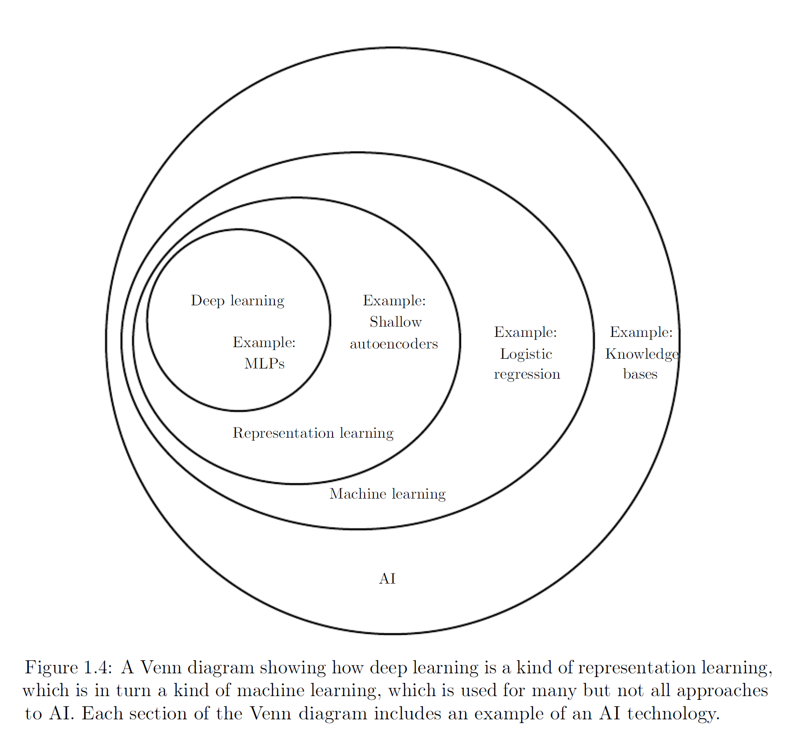{style="display:block; margin:auto; width:800px;"}

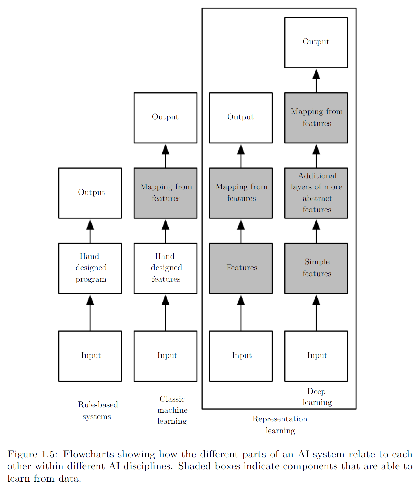{style="display:block; margin:auto; width:800px;"}

总而言之，深度学习是人工智能的一种方法，属于机器学习的一个分支。深度学习使得计算机能够通过数据和经验持续改进。作者认为，在复杂的现实世界中构建可用的AI系统，机器学习是目前唯一可行的路径。深度学习的独特之处在于它能将世界表示为一个嵌套的概念层级结构：每个复杂概念都建立在更简单概念的基础上，更抽象的表示由较少抽象的表示逐步推导得出。

深度学习已经在多个领域被证明是有用的，包括计算机视觉、语音和音频处理、自然语言处理、机器人学、生物化学、电子游戏、搜索引擎、在线广告以及金融。

## 神经网络历史简述

深度学习虽然看起来像是个新鲜事物，但其实最早可以追溯到1940年代。这个领域经历了多次改名，并且在流行起来之前的多年间并不受欢迎。本节将对深度学习的一些基本背景和发展脉络进行整理总结。整体来说，深度学习经历了三次发展浪潮：

* 第一次浪潮：1940年代到1960年代的**控制论（cybernetics）** 时期，当时生物学系理论实现了最早的感知器模型，该模型支持单个神经元的训练
* 第二次浪潮：1980年代到1990年代的**连接主义（connectionism）** 时期，其特点是利用反向传播来训练具有一层或两层隐藏层的神经网络
* 2006年开始的深度学习复兴时期，并且直到2016年才开始在书籍形式中逐渐出现

### 第一次浪潮：控制论

我们今天所熟知的一些最早期的算法，本意是构造生物学系的计算模型（computational models of biological learning），比如对大脑中学习过程的建模。因此，深度学习曾被称为**人工神经网络（artificial neural networks, ANNs）**。在这一时期，一种比较流行的观点是，大脑本身就是一个很好的例子，足以证明只能行为的可行性，那么只要能通过逆向工程找到大脑中的计算原理，那么就构成了条通往智能的直接路径。同时，另一些观点认为即便不应用于工程或实际应用，了解大脑本身及人类智能的原理本身就是机器有趣并且有价值的。

神经科学家们发现扑入动物很可能通过一个单一的算法来解决大多数大脑所要处理的任务，其中研究的比较深入的就是视觉信号和大脑中负责视觉处理的区域的关系。神经科学家们在这个方向上进行了很多研究，并且总是能有一些“巧合”出现，让人们惊奇地发现一些算法和大脑内部神经运作惊人地相似。

现代的深度学习已经超越了这种神经科学视角对机器学习模型的定义，它指向了一个更广义的学习原理：多层次组合（multiple levels of composition）。这种组合方式可以应用于各种机器学习框架，而不一定需要从神经科学中获得启发。

现代深度学习的最早前身是从神经科学的角度出发的简单线性模型。这些模型被设计为使用一组n个输入x1, ..., xn并将它们与一个输出y相关联。这些模型希望学习一组权重w1, ..., wn, 并计算他们的输出f(x, w)=x1w1 + ... + xnwn。

1943年提出的McCulloch-Pitts 神经元是一个非常早期的脑功能模型，该线性模型通过检验函数$f(x, w)$的正负来识别两种不同类型的输入。显然，该模型的权重需要正确设置后才能使得输出结果符合期望。这些权重可以由操作人员设定。

在1950年代，感知机（perceptron）是第一个能根据每个类别的输入样本来学习权重的模型。同时期的**自适应线性单元（adaptive linear element, ADALINE）**则简单地返回函数$f(x)$本身的值来预测一个实数，并且它还可以学习从数据预测这些数。这个简单的算法大大影响了机器学习的现代景象。用于调节ADALINE权重的训练算法是被称为随机梯度下降（stochastic gradient descent）的一种特例。稍加改进后的随机梯度下降算法仍然是当今深度学习的主要训练算法。

基于感知机和ADALINE中使用使用的函数$f(x,y)$为线性模型（linear model）。线性模型有许多局限性，比如它们无法学习异或函数（XOR function），即$f([0,1],w)=1, f([1,0],w)=1, f([1,1],w)=0, f([0,0],w)=0$：你无法找到一条直线能把这四个点区分开：

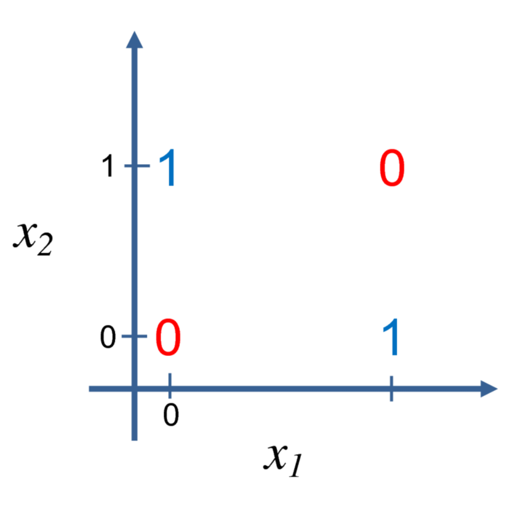{style="display:block; margin:auto; width:400px;"}

对该缺陷的批评引发了第一次浪潮的衰退。如今，**神经科学被视为深度学习研究的重要灵感来源，但不再被视为主要指导，因为我们对大脑的信息依然知之甚少。**我们如今对大脑最简单的部分都还没有理解，更不要说同时监测数千个相连的神经元的活动了。了解大脑在算法层面上如何工作的方向如今更多地被称为计算神经科学（computational neuroscience）。深度学习领域终究还是计算机科学领域的范畴，主要关注如何构建计算机系统来解决需要智能才能解决的任务。深度学习融合了线性代数、概率论、信息论、数值优化等，很多深度学习研究员完全不关心神经科学。

神经科学对深度学习最大的贡献之一，就是启发了**通过计算单元之间相互作用而变得更智能的思想**。1980年代，新认知机（Neocognitron）受哺乳动物视觉系统结构的启发，引入了一个处理图片的强大模型架构，并在后来成为了现代卷积网络的基础。

目前大多数神经网络是基于一个称为**整流线性单元（rectified linear unit）**的神经单元模型。该模型和真实的神经元计算函数并不同，但却能显著提升机器学习性能。

### 第二次浪潮：联结主义

第二次浪潮伴随着**联结主义（connectionism）**或**并行分布处理（parallel distributed processing）**潮流而出现。联结主义是在认知科学（cognitive science）的背景下出现的。认知科学是理解思维的跨学科途径，即它融合多个不同的分析层次。

在1980年代初，大多数认知科学家研究符号推理模型，但符号推理模型很难解释大脑如何使用神经元来实现推理功能。联结主义者于是开始研究真正基于神经系统实现的认知模型，其中很多复苏的想法可以追溯到心理学家Donald Hebb在1940年代的工作。

联结主义的中心思想是，当网络将大量简单的计算单元连接在一起时便可以实现智能行为。这种见解同样适用于生物神经系统中的神经元，因为它和计算模型中隐藏单元起着类似的作用。

联结主义的第一个重要概念是**分布式表示（distributed representation）**。该概念由Hinton等人提出，其思想是：系统的每一个输入都应该由多个特征表示，并且每一个特征都应该参与到多个可能输入的表示。例如，如果我们想识别红色、绿色、蓝色的汽车、卡车和鸟类，那么我们将有两种直观的方法来表示这些输入：

* 第一种方法是3x3=9种可能的组合，即使用9个神经元。每个神经元学习一个特定的类别，如红色汽车、红色卡车、红色鸟。
* 第二种是使用分布式表示，即用三个神经元表示颜色，三个神经元表示汽车、卡车和鸟类。如此一来，便只需要6个神经元了。同时，红色神经元还能从汽车、卡车、鸟类的图片中学习红色。

联结主义的另一个重要成就是**反向传播算法（back-propagatioon algorithm）**。该算法虽然曾一度黯然失色，但后来又重出江湖称为重要的主导方法之一。

1990年代，研究人员在使用神经网络进行序列建模方面取得了重要进展。Hochreiter和Schmidhuber引入**长短期记忆（long short-term memory, LSTM）**网络来解决这些难题。如今，LSTM在许多序列建模任务中广泛应用。

第二次浪潮一直持续到1990年代中期。当时很多基于神经网络与AI技术的创业公司开始寻求投资，他们野心勃勃但却有点不切实际。当AI研究还不能实现这些不合理的期望时，投资者感到失望。同时，机器学习的其他领域，如核方法（Kernel machines）和图模型（graphical models）在很多重要任务上实现了很好的效果。上述的两个因素共同导致了神经网络第二次浪潮的衰退。

虽然第二次浪潮离开了大众的视线，但在第二次浪潮退去、第三次浪潮兴起前，神经网络继续在一些人物上获得了令人印象深刻的表现。加拿大高级研究所（CIFAR）通过其神经计算和自适应感知（NCAP）研究计划帮助维持神经网络研究。该计划联合了分别由Geoffrey Hinton、Yoshua Bengio和Yann LeCun领导的多伦多大学、蒙特利尔大学和纽约大学的机器学习研究小组。这个多学科的CIFAR NCAP研究计划还囊括了神经科学家、人类和计算机视觉专家。

在那个时候，人们普遍认为深度网络（deep networks）是难以训练的。现在我们回头看，是因为当时的计算成本太高，没有可用的硬件来进行足够的实验。如今我们已经知道，1980年代就存在的算法就能工作得非常好了。

### 第三次浪潮：深度网络

第三次浪潮始于2006年的突破。Hinton表明名为深度信念网络（deep belief network）的神经网络可以使用一种称为贪婪逐层与训练（greedy layer-wise pre-training）的策略来有效地训练。其他CIFAR附属研究小组很快表明，同样的策略可以被用来训练许多其它类型的深度网络，并能系统地帮助提高在测试样例上地泛化能力。

神经网络研究的这一次浪潮普及了“深度学习”这一术语的使用，强调研究者现在有能力训练以前不可能训练的比较深的神经网络，并着力于深度的理论重要性上。此时，深度神经网络已经优于与之竞争的其他机器学习技术以及手工设计功能的AI系统。

在本书出版的时候，也即2017年，深度网络的第三次发展浪潮仍在继续。我们后面也看到了，Transformer架构的提出和ChatGPT引领的大语言模型，彻底重塑了人们查阅资料的方式，并在2025年仍飞速发展中。

## 深度学习的驱动力与正在进行的演化

### 与日俱增的数据量

很多人会问：为什么人工神经网络的第一个实验在1950年代就完成了，为什么最近才被认为是关键技术呢？深度网络长期被视为一种专家才能使用的艺术而不是技术。直到最近，随着训练数据的增加，所需要的技巧正在减少。目前在复杂任务达到人类水平的学习算法，与1980年代努力解决玩具问题的学习算法几乎是一样的。其进步的关键点就在于这些算法得以成功训练所需的资源。

由于我们的活动越来越多发生在计算机上，我们做什么也越来越多地被记录。由于我们的计算机越来越多地联网在一起，这些记录变得更容易集中管理，并更容易将他们整理成适于机器学习应用的数据集。因为统计估计的主要负担（观察少量数据以在新数据上泛化）已经减轻，因而机器学习在大数据时代变得更加容易。

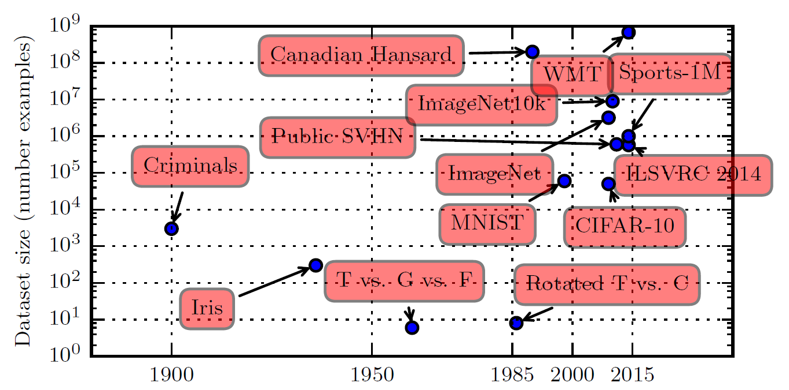{style="display:block; margin:auto; width:600px;"}

上图展示了基准数据集的大小如何随着时间的推移而增加。一个粗略的经验法则认为，监督深度学习算法在每类给定约5000个标注样本情况下一般将达到可以接受的性能，当至少有1000万个标注样本的数据集用于训练时，它将达到或超过人类表现。此外，在更小的数据集上获得成功是一个重要的研究领域，为此我们应特别侧重于如何通过无监督或半监督学习充分利用大量的未标注样本。

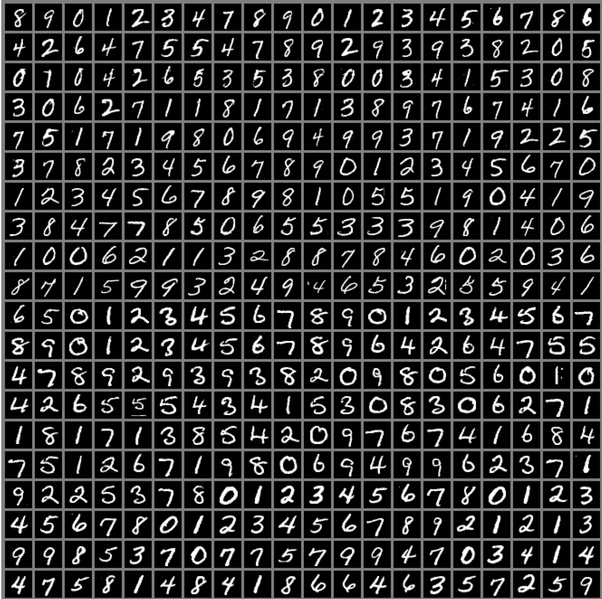{style="display:block; margin:auto; width:600px;"}

上图是MNIST数据集的输入样例，Hinton将其描述为“机器学习的果蝇”，寓意机器学习研究人员可以在受控的实验室条件下研究他们的算法。

### 与日俱增的模型规模

1980年代，神经网络只能取得较小的成功，而现在神经网络非常成功的另一个重要原因就是我们现在拥有的计算资源可以运行更大的模型。联结主义的主要见解之一就是：当许多神经元一起工作时会变得聪明。

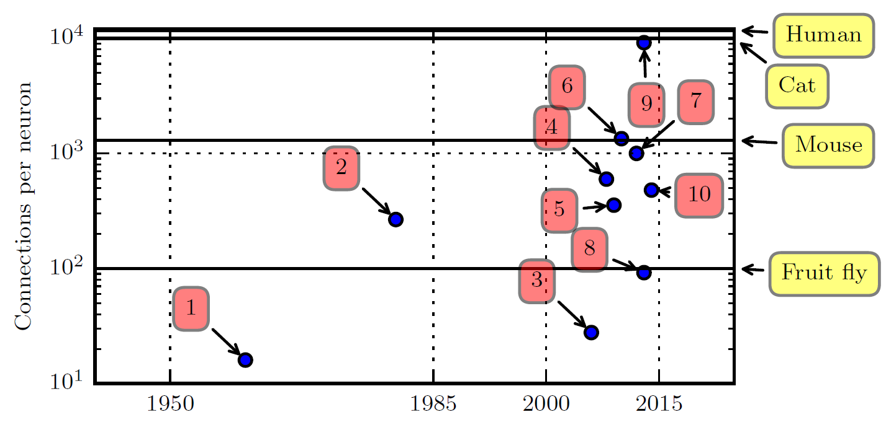{style="display:block; margin:auto; width:600px;"}

上图所示的序号代表如下模型：

1. Adaptive linear element ( **Widrow and Hoff, 1960** )
2. Neocognitron ( **Fukushima, 1980** )
3. GPU-accelerated convolutional network ( **Chellapilla  *et al.* , 2006** )
4. Deep Boltzmann machine ( **Salakhutdinov and Hinton, 2009a** )
5. Unsupervised convolutional network ( **Jarrett  *et al.* , 2009** )
6. GPU-accelerated multilayer perceptron ( **Ciresan  *et al.* , 2010** )
7. Distributed autoencoder ( **Le  *et al.* , 2012** )
8. Multi-GPU convolutional network ( **Krizhevsky  *et al.* , 2012** )
9. COTS HPC unsupervised convolutional network ( **Coates  *et al.* , 2013** )
10. GoogLeNet ( **Szegedy  *et al.* , 2014a** )

截至本书所写的2017年，机器学习模型中的神经元连接数量已经和哺乳动物的大脑在同一数量级上，神经元连接数量在1000左右（这里的神经元连接数量指的是connections per neuron，即平均每个神经元连接多少个其他神经元）。自从隐藏单元引入以来，人工神经网络的规模大约每2.4年扩大一倍。这种趋势看起来将持续数十年，除非有能力迅速扩展新技术，否则至少要到21世纪50年代，人工神经网络才能具备人脑相同数量级的神经元。生物神经元表示的功能可能比目前的人工神经元所表示的更复杂，因此生物神经网络可能比图中描绘的甚至要更大。

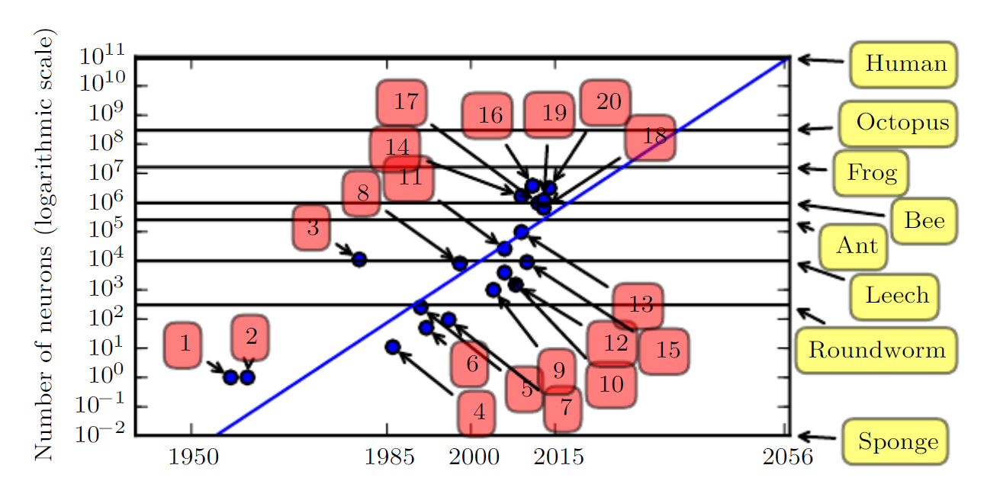{style="display:block; margin:auto; width:600px;"}

上图中的序号对应如下：

1. Perceptron (Rosenblatt, 1958, 1962)
2. Adaptive linear element (Widrow and Hoff, 1960)
3. Neocognitron (Fukushima, 1980)
4. Early back-propagation network (Rumelhart et al., 1986b)
5. Recurrent neural network for speech recognition (Robinson and Fallside, 1991)
6. Multilayer perceptron for speech recognition (Bengio et al., 1991)
7. Mean field sigmoid belief network (Saul et al., 1996)
8. LeNet-5 (LeCun et al., 1998b)
9. Echo state network (Jaeger and Haas, 2004)
10. Deep belief network (Hinton et al., 2006)
11. GPU-accelerated convolutional network (Chellapilla et al., 2006)
12. Deep Boltzmann machine (Salakhutdinov and Hinton, 2009a)
13. GPU-accelerated deep belief network (Raina et al., 2009)
14. Unsupervised convolutional network (Jarrett et al., 2009)
15. GPU-accelerated multilayer perceptron (Ciresan et al., 2010)
16. OMP-1 network (Coates and Ng, 2011)
17. Distributed autoencoder (Le et al., 2012)
18. Multi-GPU convolutional network (Krizhevsky et al., 2012)
19. COTS HPC unsupervised convolutional network (Coates et al., 2013)
20. GoogLeNet (Szegedy et al., 2014a)

上述的数据展示和讨论都是基于计算系统角度来看的。但实际上，截至上图事件的网络，其实际上的神经系统甚至不如青蛙。因此，神经元比一个水蛭还少的早期神经网络不能解决复杂的人工智能问题是很正常的。

### 与日俱增的精读、复杂度和对现实世界的冲击

自1980年代依赖，深度学习提供的精确识别和预测能力一直在提高。2012年，深度学习在ImageNet大型视觉识别挑战中迅速崛起，将最高水准的前5错误率从26.1%降到15.3%。此后，深度卷积网络连续地赢得这些比赛，截至2017年，前5错误率已降低到3.6%，如下图所示：

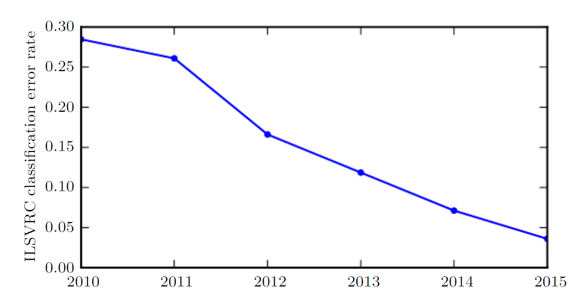{style="display:block; margin:auto; width:400px;"}

在深度网络的规模和精读有所提高的同时，他们可以解决的任务也日益复杂。这种复杂性日益增加的趋势已将其推向逻辑结论，即**神经图灵机（neural Turing machines）**的引入，它能学习读取存储单元和向存储单元写入任意内容。这样的神经网络可以从期望行为的样本中学习简单的程序。例如，从杂乱和排好序的样本中学习对一系列数进行排序。这种自我编程技术正处于起步阶段，但原则上未来可以适用于几乎所有的任务。

深度学习的另一个最大的成就是其在**强化学习（reinforcement learning）**领域的扩展。在强化学习中，一个自主的智能体必须在没有人类操作者指导的情况下，通过试错来学习执行任务。DeepMind表明，基于深度学习的强化学习系统能够学会玩Atari视频游戏，并在多种任务中可与人类匹敌。深度学习也显著改善了机器人强化学习（reinforcement learning for robotics）的性能。

许多深度学习应用都是高利润的。同时，深度学习的进步也严重依赖于软件基础架构的进展，并支持重要的研究项目或商业产品。

深度学习也为其他科学做出了贡献，比如生物制药等。作者期待深度学习未来能够出现在越来越多的科学领域中。

**总之，深度学习是机器学习的一种方法。在过去几十年的发展中，它大量借鉴了我们关于人脑、统计学和应用数学的知识。近年来，得益于更强大的计算机、更大的数据集和能够训练更深网络的技术，深度学习的普及性和实用性都有了极大的发展。未来几年充满了进一步提高深度学习并将它带到新领域的挑战和机遇。**
